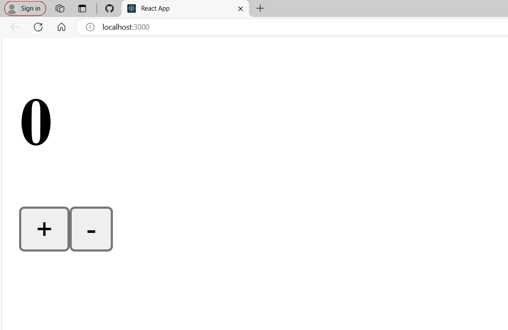
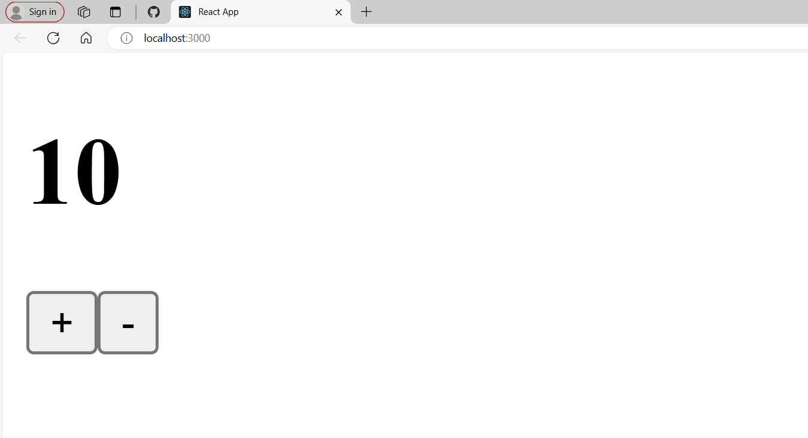
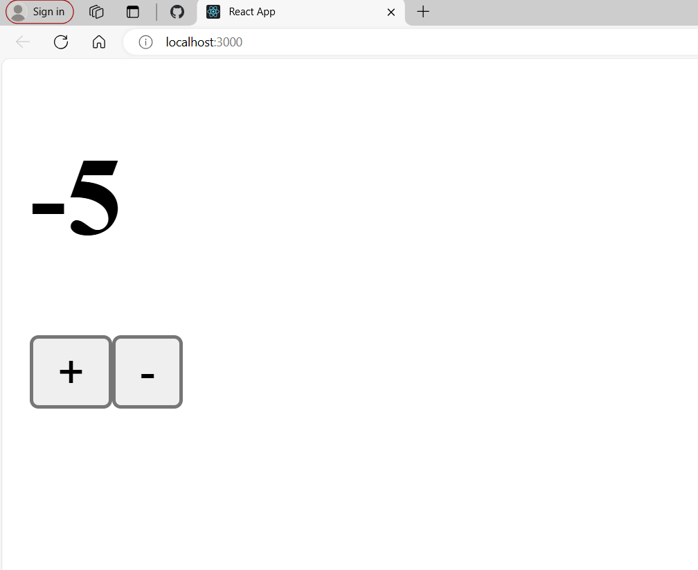

# Getting Started with Create React App

This project was bootstrapped with [Create React App](https://github.com/facebook/create-react-app).

## Simple Counter Task

Using UseState() Hook, Counter Implementation is Done!!!

This helped me to practice and understand the working of useState() Hook.

## ScreenShots: 

### Increment

### Decrement

