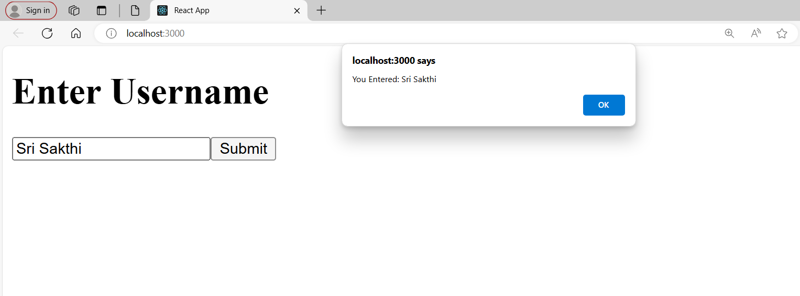

## Form Demo
- In this simple task, Using useState() Hook, the username is received as input from the user and alert is created as the username is entered. 
- Forms tag is used in React to get the input from the user.

### ScreenShot

