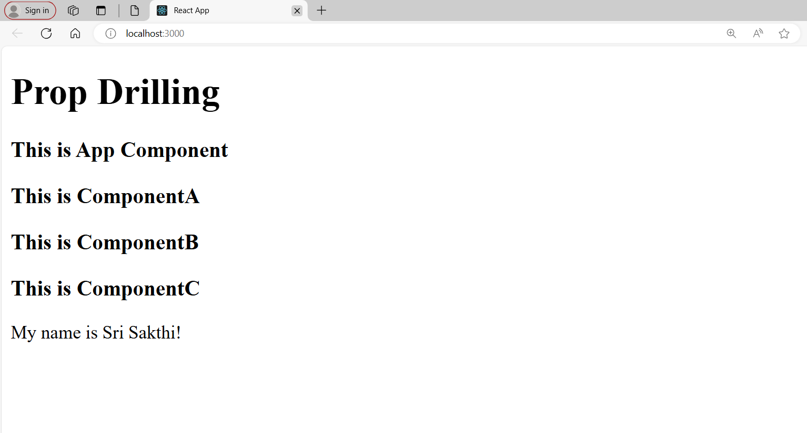

## Prop Drilling in React

### Overview

This Task demonstrates prop drilling in React, where data is passed from a parent component to deeply nested child components through intermediate components.

### Task Description

- **Parent Component**: Holds state, passing them as props to intermediate components.
- **Intermediate Components**: Relay props from the parent to child components.
- **Child Components**: Consume and use the props to display data.

### ScreenShot

