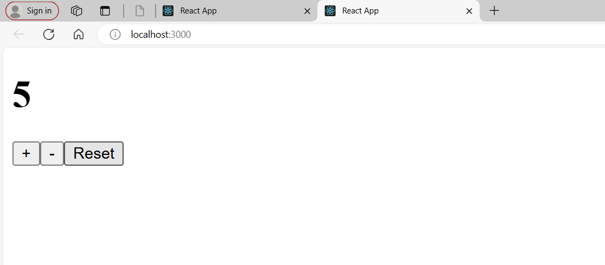

# Counter Using useReducer Hook

## Overview

This simple task demonstrates a simple counter application built with React using the `useReducer` hook for state management. The counter supports increment, decrement, and reset functionalities.

## Features

- Increment the counter
- Decrement the counter
- Reset the counter to zero

### ScreenShot

